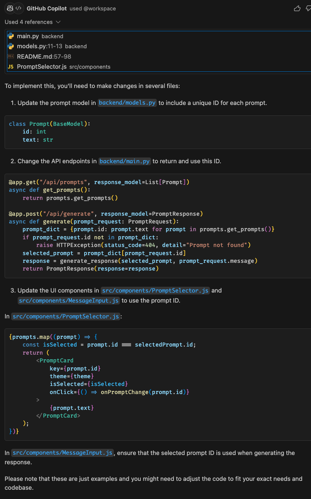
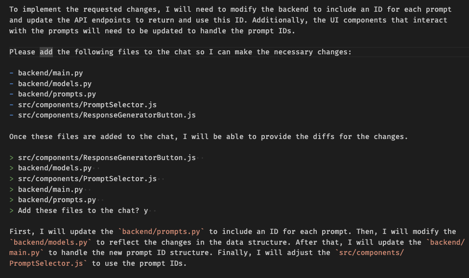
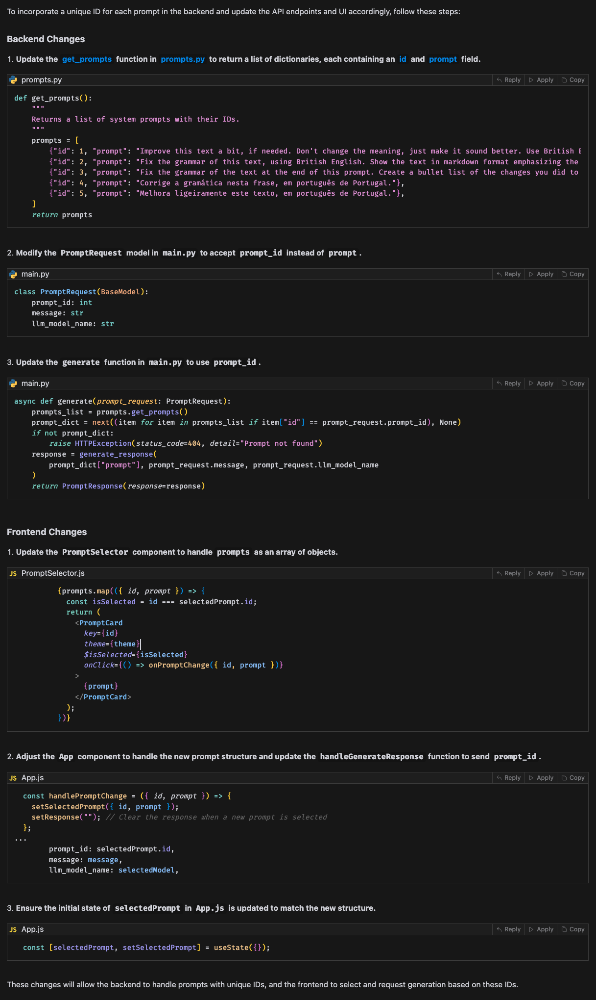

# Using AI to make changes to an existing codebase

## Introduction

AI is great and I love it. Generative AI is even better. I think many of us still feel amazed by the code that a AI assistant can generate. Say "Write the snake game in Python, using Pygame" to one of those assistants, and bang, you have a working snake game!

But what about using AI to make changes to an existing codebase? What if you could ask an AI assistant to add a new feature to your codebase, and that required changes to multiple files? Even harder, what if you just started working in a company, you don't know anything about the codebase, and you need to make some changes to it?

That's what I propose to explore in this blog post. I will try yo use an AI code assistant to make changes to an existing codebase.

For this experiment I selected GitHub Copilot, Aider and Cursor IDE, because all of them have some support to analyze a full codebase, instead of just a single file.

*Note: this is not a tutorial on how to use those tools. This is a comparison between them, and how they handle a specific task.*


## The problem

All of these AI assistants use some Large Language Models (LLM) to generate code. Some of them can work with different models, even open-source ones, but for the sake of fairness, I'm going to use GPT-4 in all of them.

For this taks to be successful, two problems need to be solved:

- The limited context window size of an LLM
- Which files need to be changed

The first problem is related to the size of the codebase. If it's to big, it's going to be impossible to fit all the code in the LLM context window. Even if we could do that, the cost would probably be too high, due to the large number of tokens used, and the LLM would probably not be able to generate a good solution using all of that amount of code.

The second problem is related to the first one. If it's not a good idea to use the whole codebase, which files should be used? The AI needs to know which files are related to the task, and which files are not.

## The Codebase

We're going to use a simple monorepo containing two projects: a React frontend application and a FastAPI backend service. The goal of this project is to provide a user interface where users can select a system prompt, input a message, and generate a response through a RESTful API.

*(It'a very simple project and it was mostly created by Cursor IDE)* 🙂

## The New feature

In the current project, prompts have no Ids. Their text is fetched by the frontend and that text is passed back again to the backend when generating a response.

I want to change this. I want to add an Id to each prompt, and use this Id in the API endpoints.

So, first of all, I need to create a prompt for the AI assistants to use. I'm going to use the same prompt for all of them, so we can compare the results more easily.

This is the prompt I will use:

```text
Change the prompt model in the backend to include a unique ID for each prompt.
The API endpoints should be changed to return and use this ID. 
The UI should also use this ID when generating the responses.
```

It's a very simple prompt but this is intentional. I want to see how the AI assistants handle this task.

Let's see how GitHub Copilot, Aider and Cursor IDE handle this task.

## GitHub Copilot

Copilot has a workspace chat mode. This feature was introduced recently and it allows Copilot to analyze a full codebase and generate code that is consistent with the codebase. Based on the prompt, Copilot tries to figure out which files from the codebase are related to the task, and includes them in the final prompt.

After running the /workspace command with the prompt, Copilot generated the following:



As you can see, it's not a very good solution. Copilot decided to get only four files from the codebase and it didn't perform all the changes that were needed.

The last message of Copilot says it all. We, humans, need to do the rest of the work. I could try to iterate with Copilot, explaining what was wrong and asking for more changes, but I thought the proposed solution was too far from what I expected to make it worth the effort.

## Aider

Aider's response is a bit better. It was able to change the PromptRequest to include an Id, but it changed only one of the prompts static data to contain an Id. It was also able to change the UI to fetch the Id and the text from the APIs but it missed the part where the UI should use the Id to generate the responses.

Here is a clipped screenshot of what Aider generated:



It started really well, selecting the files that were related to the task, and adding them to the chat.

Aider works with diffs and hunks and sometimes the generated diffs were syntactically incorrect, but Aider was able to fix them by iterating with itself, which was impressive.

However the final code was not complete and it was actually wrong in some parts.

Here I tried to fix the issues by chating with Aider again, explaining what was wrong and sometimesit could improve the solution just by looking at the error I've pasted in the chat. But at some point it got stuck, and I decided to stop the process.

One nice feature of Aider is that it actually changes the files and it can also commits the changes to the repository automatically! This is for good and for worse but it can be a nice feature if used properly.

## Cursor IDE

Cursor IDE fetched a lot of files from the codebase, including `pyproject.toml` and `.gitignore`, which usefullness is questionable. But it only includes chunks of the files in the final prompt, minimizing the context window size and the cost.

The final result, however, is amazing. Cursor IDE was able to change the Prompt model to include an Id, change the API endpoints and the UI to use that Id. Everything worked like a charm, without any human intervention!

Here is the Cursor IDE result:



The process of accepting the changes is a bit cumbersome, you have to go through each file to apply the changes, but it's a small price to pay for the quality of the final result.

## Costs

There are no free lunches. All of these tools have a cost associated with them. 

### GitHub Copilot

GitHub Copilot is probably the least expensive if you use it for other stuff as well. Since you only pay a monthly fee there is no additional cost for using it to analyze a full codebase.

### Aider

Aider is free for personal use, but you need to provide your OpenAI key, so you pay for every request made to the OpenAI API. 

Aider can also work with OpenAI API compatible models, so you can use them too. However, unless you use local LLMs, we'll have to pay for some hosting service. Bear in mind that if they are a lot cheaper than OpenAI, the results will probably be worse.

### Cursor IDE

Cursor IDE also has a free tear but it only includes 50 slow GPT-4 uses, which is definitely not enough. You have the pro option, for $20 a month, which includes 500 fast GPT-4 uses. Cursor IDE tries to keep requests to a minimum, but I imagine that for extensive use 500 uses will not be enough. You can always pay more $20 for an additional 500 uses.

## Conclusion

Cursor IDE was the clear winner in this test, the only one I would probably use for myself. I just hope they keep updating the code when VSCode updates theirs, since this is a fork of VSCode. I don't wont to be stuck in an old version of VSCode.

This is a simple test, with a very simple codebase, and it's not meant to be a definitive comparison between these three tools. I just wanted to see by myself how these tools works with a real codebase and a real task. I've watched a lot of videos showing how great those tools are, but I wanted to see it by myself, and now I can say that I'm not impressed. Again, this was not an extensive test, and maybe I'm not using the tools properly.

New tools are being developed every day, and I'm sure that in the future we will have even better tools to help us with this task (actually, while I was writing this post, I bumped into a new version of Codiumate that also supports full codebase analysis).

I intend to keep an eye on these tools and also test them with this experiment again in the future. Or perhaps with a larger codebase.

Nevertheless, my gut feeling is that this kind of tools, even when they work well, are still far from being able to replace a human developer. I believe that are really useful for small pet projects like this one, but I'm not sure about relying on them for writing production code. Time will tell.

I hope this post helps you to understand the differences between those tools and how they can help you to make changes to an existing codebase.
